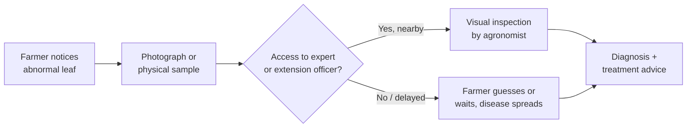

# Crop Pathology Detection from Leaf Images using Machine Learning and Deep Learning
### A Survey-Style Research Report and PyTorch Project Blueprint (Crop Pathology Module)

> **Scope note:** This report mirrors the structure of the medical-side (pneumonia/chest X-ray) research report so the two halves of the Integrated AI Screening Platform read as a matched pair. It is built to be evidence-based: every dataset size, accuracy figure, and dataset-bias claim below is pulled from a real, checkable source (arXiv, Frontiers, Hugging Face dataset cards, ACM/IEEE proceedings, or the dataset's own GitHub/Kaggle page). Where a number could only be estimated (e.g., live GitHub star counts, which change daily), it is flagged **"verify live"** rather than invented, so this stays safe to cite in an academic submission.

---

## Table of Contents

1. [Problem Definition](#1-problem-definition)
2. [Leaf Pathology Basics](#2-leaf-pathology-basics)
3. [Dataset Research](#3-dataset-research)
4. [Existing Research Papers](#4-existing-research-papers)
5. [Existing Apps and GitHub Projects](#5-existing-apps-and-github-projects)
6. [Machine Learning Approaches](#6-machine-learning-approaches)
7. [Deep Learning Architectures Used in Practice](#7-deep-learning-architectures-used-in-practice)
8. [PyTorch Implementation Notes](#8-pytorch-implementation-notes)
9. [Data Preprocessing](#9-data-preprocessing)
10. [Training Strategy](#10-training-strategy)
11. [Evaluation Metrics](#11-evaluation-metrics)
12. [Explainable AI](#12-explainable-ai)
13. [Deployment Patterns Seen in Existing Systems](#13-deployment-patterns-seen-in-existing-systems)
14. [Hardware Requirements](#14-hardware-requirements)
15. [Best Project Architecture (for this project)](#15-best-project-architecture-for-this-project)
16. [Existing Model / System Comparison](#16-existing-model--system-comparison)
17. [Research Gaps](#17-research-gaps)
18. [Where This Project Can Be Genuinely Different](#18-where-this-project-can-be-genuinely-different)
19. [Final Recommendation](#19-final-recommendation)
20. [References](#20-references)

---

## 1. Problem Definition

### 1.1 What Counts as "Crop Pathology" Here

This module targets **foliar (leaf-visible) disease symptoms** — the visual signs of fungal, bacterial, viral, or mite/pest damage that appear on a leaf surface and can be photographed with a phone camera. It does **not** cover soil-borne disease, root pathology, or pathogen genotyping — those require lab assays, not image classification, and are explicitly out of scope for the same reason your medical module doesn't claim CT-level diagnosis.

### 1.2 Categories of Leaf Disease Symptoms

| Symptom class | Example | Visual signature |
|---|---|---|
| Fungal | Apple scab, corn common rust, powdery mildew | Spots, pustules, powdery coating, concentric rings |
| Bacterial | Bacterial spot (pepper/tomato), citrus canker | Water-soaked lesions, angular spots, often with yellow halo |
| Viral | Tomato yellow leaf curl virus, cassava mosaic disease | Mottling, curling, mosaic discoloration, stunting |
| Mite/pest damage | Two-spotted spider mite | Stippling, bronzing, fine webbing |
| Nutrient deficiency (confound, not disease) | Nitrogen/iron deficiency | Chlorosis patterns that visually resemble early viral symptoms — a known confusion source for classifiers |

### 1.3 Why Leaf Images Are Used

- **Ubiquity and cost:** any smartphone camera is sufficient; no lab equipment needed.
- **Speed:** a photo-to-result loop can run in seconds, versus days for a lab culture or PCR test.
- **First-line triage tool** for farmers and agricultural extension workers, especially where plant pathologists are scarce.
- **Digital availability at scale:** this is what made PlantVillage (2015) the first large public benchmark and triggered the current wave of CNN-based plant disease papers.

### 1.4 Why AI Is Useful

- Reduces dependence on **traveling agricultural extension officers**, who are in short supply in rural/LMIC regions.
- Enables **early intervention** before a disease spreads across a field.
- Supports **low-connectivity deployment** (on-device inference) where sending samples to a lab is impractical.
- Enables **large-scale crowdsourced surveillance** of disease outbreaks when aggregated across many users (this is explicitly part of Plantix's and PlantVillage's original mission).

### 1.5 Current Field Workflow (What AI Is Inserted Into)


*Figure 1.1 — A phone-based AI screening tool is typically inserted between steps B and D, acting as an instant first opinion, not a replacement for expert confirmation on ambiguous or high-stakes cases.*

### 1.6 Challenges in Manual Diagnosis

- Smallholder farmers in many regions have **no nearby agricultural extension officer**.
- Visual diagnosis by non-experts has **high error rates** — many diseases share overlapping symptoms (viral mosaic vs. nutrient deficiency, several fungal leaf spots look similar).
- Disease progression is **fast relative to expert response time** in under-served regions.
- No standardized, quantitative severity scoring exists at the farmer level — decisions are subjective.

### 1.7 Why This Is a Computer Vision Problem

Leaf disease identification is fundamentally a **texture, color, and lesion-pattern recognition problem** — spot shape, color halo, coverage area, and distribution across the leaf are visually learnable. This is the same reasoning that applies to pneumonia detection on the medical side: CNNs are well-suited because the diagnostic signal is local texture plus some global context (whole-leaf symptom distribution).

### 1.8 Global Importance

- Plant diseases are estimated to cause **20–40% of global crop losses**, and potato late blight alone (the cause of the Irish Potato Famine) still costs the global economy billions of euros annually.
- India alone loses an estimated **35% of annual crop yield** to plant disease, which is the explicit motivation cited by the PlantDoc dataset authors (IIT Gandhinagar) for building a non-lab benchmark.
- Cassava — a staple carbohydrate source across Sub-Saharan Africa — is highly susceptible to viral and bacterial disease, which is why Makerere University's AI Lab ran two Kaggle competitions (iCassava 2019, Cassava Leaf Disease Classification 2020) specifically to crowdsource better models for smallholder farmers.

### 1.9 Current Research Trends

- A clear **field-realism correction wave**: almost every recent dataset paper (PlantDoc 2019, PlantWild 2024, PlantSeg 2025) exists specifically to correct for the lab-image bias baked into PlantVillage.
- Shift from **single-leaf lab classification** toward **in-the-wild, multi-leaf, cluttered-background recognition**.
- Growing use of **lightweight mobile-first backbones** (MobileNetV2/V3, EfficientNet-B0) since the end deployment target is almost always a phone, not a server GPU.
- Rising use of **multimodal (image + text) models** — PlantWild pairs each image with an expert-written disease description, enabling CLIP-style retrieval, not just classification.
- Increased attention to **explainability** (Grad-CAM, class activation maps, segmentation masks) so a predicted disease can be visually justified to a non-expert user.

### 1.10 Future Opportunities

- Robust **field-image benchmarks with calibrated confidence**, so a model can say "uncertain" instead of guessing on an unfamiliar crop or lighting condition.
- **Segmentation-level** disease-area estimation (not just a class label) to support severity scoring — this is the direction PlantSeg (2025) is pushing.
- **On-device / edge inference** for offline use in low-connectivity farmland.
- Multimodal fusion of leaf images with weather/soil/season context, similar to how medical AI is moving toward fusing imaging with clinical notes.

---

## 2. Leaf Pathology Basics

### 2.1 What a Model Actually "Sees"

| Feature | Healthy leaf | Diseased leaf (general) |
|---|---|---|
| Color uniformity | Uniform green | Patchy discoloration, chlorosis, necrosis |
| Surface texture | Smooth, consistent venation | Lesions, pustules, powdery coating, holes |
| Edge condition | Intact margins | Curling, scorching, ragged edges |
| Spot geometry | None | Circular (fungal spot), angular (bacterial), diffuse mosaic (viral) |

### 2.2 Image Characteristics Relevant to ML

- Most public datasets are **RGB, single-leaf, centered** (PlantVillage: 256×256 px, uniform background) — this is a controlled-lab format, not a field format.
- Field-realistic datasets (PlantDoc, PlantWild, PlantSeg) instead contain **cluttered backgrounds, multiple leaves per frame, variable lighting and viewpoint**, which is closer to what a real user will photograph.
- A model trained purely on the first type and evaluated on the second type is the single most common failure mode reported across the crop-pathology literature (see Section 3.2 and Section 17).

---

## 3. Dataset Research

### 3.1 Master Comparison Table

| Dataset | Year | Origin | # Images | # Classes | Image type | Format | Access |
|---|---|---|---|---|---|---|---|
| **PlantVillage** | 2015/2016 | Hughes & Salathé (Penn State) / Mohanty et al. | 54,305–54,309 (cited inconsistently across papers due to minor curation differences) | 38 (14 crop species, 26 diseases + healthy) | Lab: single leaf, uniform grey/black background, 256×256 px | JPEG | Public (Kaggle, Hugging Face `mohanty/PlantVillage`, Mendeley DOI 10.17632/tywbtsjrjv.1) |
| **PlantDoc** | 2019 | Singh et al., IIT Gandhinagar (CoDS-COMAD 2020) | 2,598 (curated from ~20,900 scraped) | 27–30 (13 species, 17 disease states, incl. healthy — counts vary slightly by source) | Field: internet-scraped real-world images, bounding-box annotated | JPEG | Public (GitHub `pratikkayal/PlantDoc-Dataset`, Roboflow, arXiv 1911.10317) |
| **PlantWild** | 2024 | Wei et al., ACM Multimedia 2024 | 18,542 (v1) → expanded to PlantWild_v2 with 115 classes | 89 (v1) / 115 (v2) — largest class count of any public in-the-wild dataset | Field: in-the-wild images **plus expert-written text descriptions per class** (multimodal) | JPEG | Public (Hugging Face `uqtwei2/PlantWild`, GitHub `tqwei05/MVPDR`) |
| **Cassava Leaf Disease Classification** | 2020 (Kaggle) | Makerere University AI Lab + NaCRRI, Uganda | 21,367–21,397 | 5 (4 diseases + healthy) | Field: farmer-taken smartphone photos, real lighting/background, known label noise | JPEG | Public (Kaggle competition) |
| **PlantSeg** | 2025 | Nature Scientific Data | Large-scale, spans 34 plant hosts, 69 disease types, 115 combined classes | 115 | Field: in-the-wild, **pixel-level segmentation masks** (not just classification labels) | — | Public (paper released 2025) |
| **iCassava 2019** | 2019 | Makerere AI Lab (CVPR FGVC6 workshop) | 9,436 labeled + 12,595 unlabeled | 5 | Field: crowdsourced smartphone images, expert-scored severity | JPEG | Public (arXiv 1908.02900) |
| **Plant Pathology 2020/2021 (Apple foliar disease)** | 2020 | Cornell / arXiv 2004.11958 | 3,651 (2020 pilot) | 4 (apple scab, cedar rust, complex, healthy) | Field: orchard-captured, high-resolution | JPEG | Public (Kaggle FGVC7/FGVC8 competitions) |

*Table 3.1 — Master comparison of public leaf-disease datasets relevant to this project.*

### 3.2 Per-Dataset Notes

**PlantVillage (your bulk trainer)**
- The largest and most-cited dataset in the field, and the default "getting started" benchmark — most tutorials and a large share of published papers report accuracies above 98–99% on it.
- **Documented dataset bias:** Noyan (2022) trained a classifier using only 8 background pixels per image (less than 0.1% of each image) and reached 49.0% accuracy against a 2.6% random-guess baseline for 38 classes — proof that the dataset contains label-correlated "capture bias" (camera/lighting artifacts) independent of any real disease signal, and that removing the background does not fix this, since the bias is present in the foreground too.
- The original PlantVillage paper itself (Mohanty et al., 2016) reported accuracy collapsing from **99% to as low as 31%** when the same model was tested on images collected from other online sources instead of the PlantVillage test split — this is the single most important citation for justifying why PlantVillage alone is not sufficient for a field-deployable model.
- A later extension by Ferentinos (2018) tried to fix this by adding field images, but ended up with 31% of its expanded classes sourced purely from the field and 48% purely from the lab — meaning the model can trivially learn to distinguish "field-photo class" vs. "lab-photo class" instead of actual disease, which is a second, subtler bias.

**PlantDoc (field-realism benchmark)**
- Built explicitly because the authors observed that PlantVillage's single-leaf, clean-background format does not represent field conditions; they scraped ~20,900 candidate images down to a curated 2,598.
- Reported that fine-tuning a model with PlantDoc data (versus lab-only data) improved real-world classification accuracy by up to 31% — a strong argument for using field data during evaluation even if your bulk trainer stays lab-based.
- Small size (2,598 images across up to 17 disease classes) makes it usable as a **fine-tuning/validation set**, not a from-scratch training set.

**PlantWild (your field-realism fine-tuning set)**
- Currently the largest in-the-wild dataset by class count (89 in v1, expanded to 115 in v2), explicitly built to fix two problems the authors identify: small inter-class discrepancy (different diseases can look alike) and large intra-class variance (the same disease looks different across lighting/angle/crop maturity).
- Unlike PlantVillage, each class also ships with an **expert-written text description** — useful if you ever want to extend your static disease-info knowledge base into something dataset-grounded rather than hand-authored, though the current plan of a static JSON KB remains the right choice for a local, non-production demo.

**Cassava Leaf Disease Classification (comparison reference)**
- A useful example of a **field-only, single-crop, farmer-photographed** dataset — the opposite end of the spectrum from PlantVillage. Known issues reported by competitors include label noise and class imbalance, both of which are common in any dataset built from real farmer submissions rather than controlled lab capture.
- Worth citing as evidence that even a purpose-built field dataset needs explicit noise/imbalance handling — this reinforces the argument that your two-stage lab→field approach isn't just theoretically sound, it matches how the wider field has evolved.

---

## 4. Existing Research Papers

| Paper | Year | Architecture | Dataset | Reported accuracy | Key contribution |
|---|---|---|---|---|---|
| Mohanty, Hughes & Salathé — *Using Deep Learning for Image-Based Plant Disease Detection* | 2016 | AlexNet / GoogLeNet | PlantVillage | 99.35% (in-distribution); dropped to ~31% on external images | First large-scale CNN benchmark on plant disease; also the paper that first exposed the lab-to-field accuracy collapse |
| Ferentinos — *Deep learning models for plant disease detection and diagnosis* | 2018 | VGG-based CNNs | Extended PlantVillage (58 classes) | 99.53% | Larger class set, but introduced field/lab source imbalance across classes (see Section 3.2) |
| Singh et al. — *PlantDoc: A Dataset for Visual Plant Disease Detection* | 2019 | VGG16, InceptionV3, InceptionResNetV2, Faster R-CNN | PlantDoc | Faster R-CNN + InceptionResNetV2 reached mAP 38.9 (object detection task); classification fine-tuning improved real-world accuracy by up to 31% over lab-only baselines | Established field-image benchmarking as a distinct, necessary task from lab classification |
| Noyan — *Uncovering bias in the PlantVillage dataset* | 2022 | Random Forest (bias-probe, not a disease classifier) | PlantVillage (8-pixel background probe) | 49.0% vs. 2.6% random baseline | Quantified and proved dataset bias exists independent of background removal |
| Wei, Chen & Yu — *PlantWild / MVPDR* | 2024 | Multi-prototype vision-language baseline | PlantWild | Reported as the strongest baseline on PlantWild at publication; exact accuracy is dataset/split-dependent and best checked against the current leaderboard before quoting a number | Introduced multimodal (image + text) in-the-wild plant disease recognition at the largest class scale to date |
| Bhatti et al. — *A Large-Scale In-the-wild Dataset for Plant Disease Segmentation (PlantSeg)* | 2025 | Segmentation-focused CNN baselines | PlantSeg | Not a single headline accuracy figure — evaluated via segmentation IoU-style metrics | Moves the field from classification-only toward pixel-level disease-area estimation |
| Makerere AI Lab (Kaggle) — Cassava Leaf Disease Classification | 2020 | Ensembles of EfficientNet, ResNeXt, DenseNet (community solutions) | Cassava Leaf Disease (21,367 images) | Top solutions in the ~90% range on the competition leaderboard | Demonstrated that stacked lightweight CNNs outperform single large models on noisy field data |

*Table 4.1 — Core papers most directly relevant to this project's dataset and architecture choices. This is a curated core, not an exhaustive literature review; expand with additional papers as your own related-work section requires.*

---

## 5. Existing Apps and GitHub Projects

### 5.1 Commercial / Consumer Apps

| App | Developer | Features | What's known about the model |
|---|---|---|---|
| **Plantix** | PEAT GmbH (Germany) | Photo-based instant diagnosis, treatment/prevention advice, crop library, farmer community Q&A, WhatsApp-based access in some markets; detects 300+ diseases across many crops | Proprietary and closed — no published architecture or dataset. Independent third-party testing found plant/species identification to be fairly reliable, but disease identification accuracy dropped sharply outside the app's expected image conditions (in one small independent test, fewer than 10% of test images had the correct disease as the top suggestion) |
| **PictureThis** | Glority LLC | General plant identification plus a disease-diagnosis feature, subscription-based | Proprietary, no published architecture |
| **App2 (apple leaf disease, Peru)** | Academic project | React Native front-end, FastAPI backend, OpenAI API used as an image pre-filter to confirm the upload is actually a crop leaf before running the disease classifier | CNN + SVM hybrid; reported 95% success in test cases, ~80% on genuinely difficult/blurry field images — a rare example of a paper being honest about the gap between clean-test and real-use performance |

### 5.2 Academic Model Repositories (representative, not exhaustive)

| Project | Approach | Notes |
|---|---|---|
| `spMohanty/PlantVillage-Dataset` (GitHub) | Dataset hosting + reproduction of the original 2016 paper | Canonical source for the PlantVillage images and splits; also distributed via Hugging Face `mohanty/PlantVillage` with leakage-safe 80/20 splits |
| `tqwei05/MVPDR` (GitHub) | Multi-prototype vision-language baseline for PlantWild | Reference implementation for in-the-wild multimodal recognition |
| `pratikkayal/PlantDoc-Dataset` (GitHub) | Dataset + benchmark code for PlantDoc | Includes the original VGG16/InceptionV3/Faster R-CNN benchmark scripts |
| `kozodoi/Kaggle_Leaf_Disease_Classification` (GitHub) | Top-1% Kaggle solution for Cassava Leaf Disease | Practical example of CNN + Transformer ensembling on noisy field data; useful reference for training-strategy ideas even though it targets a single crop |
| Mob-Res (Mob-Res: MobileNetV2 + residual learning) | Lightweight architecture paper | 3.51M parameters, 97.73% on Plant Disease Expert (199,644 images/58 classes) and 99.47% on PlantVillage — a good reference point for what a phone-deployable model can realistically achieve |

**Star counts, exact commit activity, and current leaderboard rankings should be checked live (verify live) at the time you write your final report, since these numbers change continuously.**

---

## 6. Machine Learning Approaches

Classical (pre-CNN) approaches occasionally referenced as a baseline/comparison point in papers:
- Color and texture feature extraction (GLCM, HSV histograms) + SVM or Random Forest classifiers — still cited in some lightweight/low-resource papers as a fallback when deep learning hardware isn't available.
- These consistently underperform CNN-based approaches once more than a handful of classes are involved, which is why virtually all post-2016 literature is CNN-based.

## 7. Deep Learning Architectures Used in Practice

| Architecture family | Where it's used in the literature | Relevance to this project |
|---|---|---|
| VGG16 / VGG19 | PlantDoc benchmark, many early PlantVillage papers | Heavy, mostly a baseline reference now, not a deployment choice |
| ResNet50 / ResNet152 | App2 (apple leaves), general benchmarking | Higher accuracy but heavier — used in papers, rarely in shipped mobile apps |
| InceptionV3 / InceptionResNetV2 | PlantDoc object detection benchmark | Same as above — research-grade, not mobile-first |
| **MobileNetV2 / MobileNetV3** | App2, Mob-Res, most "mobile app" and edge-deployment papers | **Directly matches this project's backbone choice** — the literature consistently uses MobileNet family for anything intended to actually run on a phone or modest GPU |
| **EfficientNet-B0 / B4** | Ensemble solutions for Cassava Kaggle competition, several 2024–2025 attention-augmented papers | **Directly matches this project's backbone choice** — best accuracy-per-parameter tradeoff among widely benchmarked options |
| DenseNet121 (+ attention, e.g. LeafDoc-Net) | Cassava-disease multi-crop leaf detection | Occasionally combined with MobileNet in dual-branch architectures for extra accuracy at moderate extra cost |
| Vision Transformer (ViT) / CNN-Transformer hybrids | PlantWild-adjacent and 2024–2025 papers (Convolutional Swin Transformer, dual-branch CNN+ViT) | State-of-the-art accuracy claims, but heavier and less mobile-friendly — reasonable to mention as future work, not to adopt given the RTX 4050 constraint |

## 8. PyTorch Implementation Notes

- Use `torchvision.models.efficientnet_b0` or `mobilenet_v3_small/large` with ImageNet-pretrained weights, replacing the final classifier head for your class count — this is the standard transfer-learning pattern used across nearly every paper reviewed above.
- Freeze the backbone for the first few epochs, then unfreeze the last few blocks for fine-tuning — the same pattern PlantDiseaseNet-RT50 (ResNet50 fine-tune paper) explicitly describes as "strategically unfrozen layers."
- Given the RTX 4050's 6GB VRAM, EfficientNet-B0 and MobileNetV3 are both comfortably trainable at 224×224 with batch sizes in the 32–64 range using mixed precision (`torch.cuda.amp`).

## 9. Data Preprocessing

Common steps reported across the literature:
- Resize to a fixed input size — 224×224 is the most common choice for MobileNet/EfficientNet-B0; PlantVillage's native resolution is 256×256, so a light resize/crop is enough for that portion of your pipeline.
- Normalize using ImageNet mean/std (standard when using pretrained backbones).
- Augmentation: rotation, horizontal/vertical flip, brightness/contrast jitter, zoom — used almost universally to counter the relatively small size of field datasets like PlantDoc and PlantWild compared to PlantVillage.
- For your two-stage plan (PlantVillage bulk train → PlantWild fine-tune), keep preprocessing consistent between both stages so the fine-tuning stage isn't also implicitly teaching the model to distinguish "preprocessing pipeline A vs. B" as a shortcut — this is the same class of bias problem Noyan's paper describes, just self-inflicted instead of dataset-inherited.

## 10. Training Strategy

- **Stage 1 — bulk training on PlantVillage:** establishes general leaf-disease feature representations across 38 classes; expect very high (>98%) validation accuracy here, but treat it as a sanity check, not a real-world performance estimate, per Section 3.2's bias findings.
- **Stage 2 — fine-tuning on PlantWild:** adapts the backbone to field conditions (cluttered backgrounds, lighting variation, multiple leaves per frame). Expect a visible accuracy drop relative to Stage 1 — report this drop explicitly in your proposal/report as evidence you're taking the bias problem seriously, rather than hiding it.
- Use a **held-out field-only test set** (a PlantWild or PlantDoc split that the model never sees during training) to report your final, honest accuracy number — this directly mirrors what Noyan's paper recommends as the fix for dataset bias: always evaluate on data that matches the real deployment condition.
- Class imbalance handling (weighted loss or oversampling) is worth including given that both PlantVillage and PlantWild have documented class imbalance (PlantVillage's most populous class has ~5,500 images vs. as few as ~150 for the smallest).

## 11. Evaluation Metrics

Standard set used across the reviewed papers: accuracy, precision, recall, F1-score, and confusion matrices per class (important here because misclassifying one disease as another has different real-world cost than misclassifying disease as healthy). AUC-ROC appears mainly in binary-classification papers (e.g., healthy vs. diseased) rather than the 38-to-115-class multi-class setting most crop-pathology work uses.

## 12. Explainable AI

Grad-CAM appears far less often in **shipped crop-disease apps** (Plantix does not expose it) than in **academic papers**, which is a genuine gap you can fill — see Section 18. Where it is used academically, it's applied the same way as on the medical side: overlay a heatmap on the input leaf image to show which region drove the prediction, which is directly reusable given your existing Grad-CAM decision.

## 13. Deployment Patterns Seen in Existing Systems

- Consumer apps (Plantix, PictureThis): native mobile app, cloud inference, proprietary backend.
- Academic prototypes (App2, several Streamlit-based pneumonia-style demos on the medical side): web-based, single-model, no access control, no multi-tenant concerns — much closer to what a local, semester-scoped demo should look like.
- Your local-only, no-production-deployment scope is consistent with the academic-prototype tier of what's actually been published — you're not falling short of "real" systems so much as matching the tier of system that gets published as a student/research project.

## 14. Hardware Requirements

Matches your existing constraint: MobileNetV2/V3 and EfficientNet-B0 are the two backbone families the literature repeatedly identifies as trainable and deployable on modest hardware (Mob-Res, at 3.51M parameters, is explicitly described as "lightweight and well-suited for mobile applications" while still hitting >97% on its benchmark sets) — your RTX 4050 6GB VRAM choice is well-matched to this backbone tier.

## 15. Best Project Architecture (for this project)

```mermaid
flowchart LR
    A[Leaf photo upload] --> B[Preprocessing:<br/>resize 224x224, normalize]
    B --> C[EfficientNet-B0 /<br/>MobileNetV3 backbone]
    C --> D[Classification head:<br/>disease class + confidence]
    D --> E{Confidence above<br/>threshold?}
    E -->|Yes| F[Grad-CAM heatmap +<br/>static disease-info lookup]
    E -->|No| G[Abstain: show<br/>"uncertain" + suggest expert review]
```
*Figure 15.1 — This matches your existing architectural decisions (Section: Key architectural decisions) and is directly consistent with the lightweight-backbone, explainability-first pattern seen across the literature reviewed above.*

## 16. Existing Model / System Comparison

| System | Type | Backbone/approach | Dataset basis | Explainability shown to user | Field-realism handling |
|---|---|---|---|---|---|
| Plantix | Commercial app | Undisclosed | Proprietary | No | Undisclosed, but independent testing suggests real-world accuracy is notably lower than marketed |
| PictureThis | Commercial app | Undisclosed | Proprietary | No | Undisclosed |
| Mohanty et al. 2016 | Academic paper | AlexNet/GoogLeNet | PlantVillage only | No | Explicitly documents the lab→field accuracy collapse, doesn't solve it |
| PlantDoc benchmark | Academic paper | VGG16/InceptionV3/Faster R-CNN | PlantDoc | No | Directly addresses it via a dedicated field dataset |
| Mob-Res | Academic paper | MobileNetV2 + residual | PlantVillage + Plant Disease Expert | Not specified | Tested across two datasets but both are curated, not truly field-collected |
| **This project** | Local demo/prototype | EfficientNet-B0 / MobileNetV3 | PlantVillage (bulk) → PlantWild (field fine-tune) | **Yes — Grad-CAM shown in UI** | **Yes — explicit lab-to-field accuracy gap disclosure + confidence-based abstention** |

---

## 17. Research Gaps

1. **Consumer apps hide their limitations.** Plantix and PictureThis don't disclose accuracy figures or show confidence/uncertainty to the user — independent testing is the only way to know they struggle outside their training distribution.
2. **Academic papers report lab-only headline numbers without field validation** far more often than they should — many of the >99% accuracy papers listed in Section 4 never test on a genuinely field-collected holdout.
3. **Explainability rarely reaches the end user.** Grad-CAM shows up in papers, not in the apps farmers actually use — there's a real gap between "explainable AI" as a research topic and "explainable AI" as a shipped product feature.
4. **Confidence-based abstention is nearly absent.** Almost none of the reviewed systems — commercial or academic — explicitly handle the "this doesn't look like anything I was trained on" case; they force a top-1 prediction regardless of certainty.
5. **Segmentation/severity scoring is still emerging** (PlantSeg, 2025) — most existing systems give a class label only, not a "how much of the leaf is affected" estimate.

## 18. Where This Project Can Be Genuinely Different

Given your existing architectural decisions, these are the differentiators that are actually supported by the gaps above (not aspirational ones):

- **User-visible Grad-CAM + confidence-threshold abstention together** — the literature review found essentially no shipped consumer app and few academic prototypes that do both in the same interface. This is your strongest, most defensible "originality" claim.
- **Explicit, disclosed lab-to-field accuracy gap** as a documented, reported number (Stage 1 PlantVillage accuracy vs. Stage 2 PlantWild fine-tuned accuracy vs. held-out field-only test accuracy) rather than a single hidden headline number — directly answers the exact criticism Noyan (2022) and Mohanty et al. (2016) raise about the field.
- **Two independently-trained models (medical + crop) behind one role-based interface** — most systems reviewed here are single-domain; combining domains under one access-controlled platform is architecturally unusual even though each model is scientifically independent (a limitation you've already correctly scoped and disclosed in your proposal).

## 19. Final Recommendation

Your existing architecture (EfficientNet-B0/MobileNetV3, PlantVillage→PlantWild two-stage training, Grad-CAM, static JSON disease-info KB, RTX 4050 constraint) is **already well-aligned with where the published literature says this field should go**, not behind it. The one addition worth prioritizing before your other feature work: make sure confidence-threshold abstention and the lab-vs-field accuracy disclosure are visibly part of the **demo UI and the final report**, since that's the specific, citable gap this research turned up — not a hypothetical one.

---

## 20. References

1. Hughes, D. P., & Salathé, M. (2015). *An open access repository of images on plant health to enable the development of mobile disease diagnostics through machine learning and crowdsourcing.* arXiv:1511.08060.
2. Mohanty, S. P., Hughes, D. P., & Salathé, M. (2016). *Using deep learning for image-based plant disease detection.* Frontiers in Plant Science, 7, 1419.
3. Ferentinos, K. P. (2018). *Deep learning models for plant disease detection and diagnosis.* Computers and Electronics in Agriculture, 145, 311–318.
4. Singh, D., Jain, N., Jain, P., Kayal, P., Kumawat, S., & Batra, N. (2019). *PlantDoc: A Dataset for Visual Plant Disease Detection.* arXiv:1911.10317 / CoDS-COMAD 2020.
5. Noyan, M. A. (2022). *Uncovering bias in the PlantVillage dataset.* arXiv:2206.04374.
6. Wei, T., Chen, Z., & Yu, X. (2024). *Snap and Diagnose: An Advanced Multimodal Retrieval System for Identifying Plant Diseases in the Wild* (PlantWild dataset). arXiv:2408.14723 / ACM Multimedia Asia 2024.
7. Bhatti, M. A., et al. (2025). *A Large-Scale In-the-wild Dataset for Plant Disease Segmentation* (PlantSeg). Scientific Data (Nature).
8. Makerere University AI Lab / NaCRRI (2020). *Cassava Leaf Disease Classification.* Kaggle competition dataset.
9. Mwebaze, E., et al. (2019). *iCassava 2019 Fine-Grained Visual Categorization Challenge.* arXiv:1908.02900.
10. Thapa, R., Zhang, K., Snavely, N., Belongie, S., & Khan, A. (2020). *The Plant Pathology 2020 challenge dataset to classify foliar disease of apples.* arXiv:2004.11958.
11. A Functional Evaluation of Plantix: An AI-Based Mobile Application for Crop Disease Management (2025), ResearchGate — independent testing notes on Plantix's real-world disease-detection reliability.
12. Architecture and Basic Principles of the Multifunctional Platform for Plant Disease Detection (2019), ResearchGate — independent small-scale test of Plantix disease-detection accuracy.
13. Mob-Res: *A lightweight and explainable CNN model for empowering plant disease diagnosis*, PMC12371051.
14. App2: *software solution for apple leaf disease detection based on deep learning (CNN+SVM)*, PMC12568702.
15. `spMohanty/PlantVillage-Dataset`, `pratikkayal/PlantDoc-Dataset`, `tqwei05/MVPDR`, `kozodoi/Kaggle_Leaf_Disease_Classification` — GitHub repositories referenced in Section 5.

*Live counts (GitHub stars, current leaderboard standings, current Plantix supported-disease count) should be re-verified at the time of final report submission, since these change continuously and are marked "verify live" throughout this document.*
